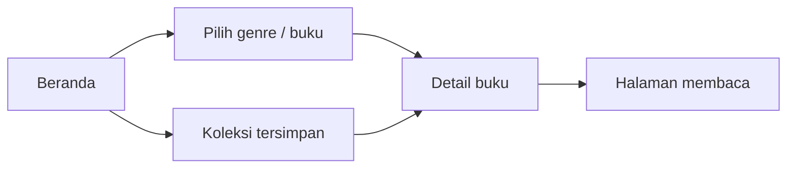

# AmbaRead Mobile

Bagian mobile dari paket AmbaRead: aplikasi Flutter untuk menjelajahi buku, menelusuri genre, menyimpan koleksi, dan membuka halaman membaca.

**Flutter · Dart · Provider**

[Ringkasan produk AmbaRead](https://github.com/Agimmm/ambaread#readme) · [Source aplikasi](lib) · [Dependensi](pubspec.yaml)

## Hubungan dengan portofolio

Repo ini menjadi pintu masuk dokumentasi mobile dalam paket AmbaRead. **Kontribusi Amir Gymnastiar pada produk AmbaRead adalah Backend Web Engineer**; dokumentasi mobile melengkapi gambaran produk.

## Alur aplikasi



## Peta source

| Lokasi | Fungsi |
| --- | --- |
| [lib/main.dart](lib/main.dart) | Entry point, Provider, dan beranda. |
| [lib/genre_page.dart](lib/genre_page.dart) | Penelusuran berdasarkan genre. |
| [lib/library_page.dart](lib/library_page.dart) | Koleksi buku tersimpan. |
| [lib/book_reader_page.dart](lib/book_reader_page.dart) | Tampilan pembaca buku. |
| [lib/profile_page.dart](lib/profile_page.dart) | Profil pengguna. |
| [lib/models](lib/models) | Model buku dan pengguna. |
| [lib/providers](lib/providers) | State buku, koleksi, dan profil. |

## Menjalankan source Flutter

Siapkan Flutter dengan Dart yang memenuhi `sdk: ^3.7.0` pada `pubspec.yaml`, kemudian:

```bash
flutter pub get
flutter run
```

Pilih perangkat atau emulator yang sesuai. Alur yang mengakses PHP memerlukan backend dan alamat layanan yang sesuai dengan lingkungan lokal. Source katalog dan state mobile tidak mengasumsikan sinkronisasi penuh dengan web.

## Repositori terkait

- [AmbaRead Web dan studi kasus utama](https://github.com/Agimmm/ambaread)
- [Ambaread_Mobile](https://github.com/Agimmm/Ambaread_Mobile)
- [ambamobilefinal](https://github.com/Agimmm/ambamobilefinal)

Pada peninjauan dokumentasi 18 September 2026, ketiga repo mobile memiliki isi yang identik pada `lib/` dan `pubspec.yaml`. Repo ini dipakai sebagai rujukan agar pengunjung memiliki satu titik awal.
